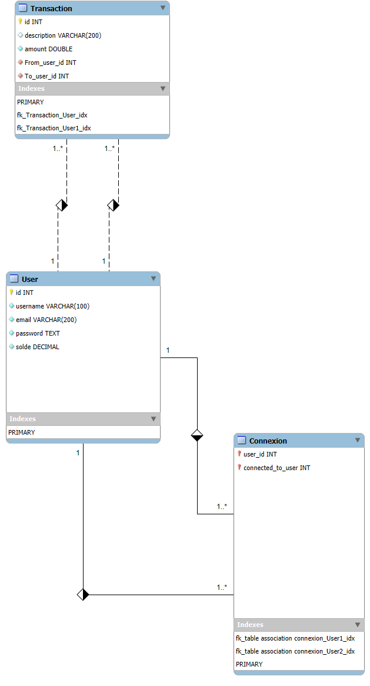

# Projet : PayMyBuddy

Application de paiement entre particuliers (Version prototype)

Permet la gestion des connexions et des virements entre utilisateurs.

---

## 🛠️ Outils & Librairies utilisées

Projet basé sur **Spring Boot** et **Maven** connecté à une base **PostgreSQL** :

- **Spring Boot** : 3.5.0
- **Java** : 21
- **PostgreSQL** : 17
- **Apache Maven** : 3.9.9

### 📦 Starters Spring utilisés

- `spring-boot-starter-web`  
- `spring-boot-starter-data-jpa`  
- `spring-boot-starter-security`  
- `spring-boot-starter-validation`  
- `spring-boot-devtools`  
- `lombok`  
- `postgresql` (driver)
---

## 🔑 Gestion des paramètres sensibles (identifiants/base de données)

Les identifiants et accès à la base de données ne doivent pas être stockés en clair dans le code source.

Pour cela, utilisez des **variables d’environnement** lors du démarrage de l’application.  
Vous pouvez stocker ces variables dans un fichier `.env` à la racine du projet **pour plus de confort** (attention : Spring Boot ne lit pas `.env` nativement, voir "Note" ci-dessous).

**Variables à définir :**
- `DB_HOST`
- `DB_PORT`
- `DB_NAME`
- `DB_USERNAME`
- `DB_PASSWORD`

Exemple de contenu pour votre `.env` :

DB_HOST=localhost
DB_PORT=6060
DB_NAME=paymybuddy
DB_USERNAME=myappuser
DB_PASSWORD=MON_MOT_DE_PASSE

## 🗃️ Installation rapide

1. **Récupérez le projet** (clonez le dépôt ou téléchargez les sources).
2. **Définissez** les variables d’environnement nécessaires (`DB_HOST`, `DB_PORT`, `DB_NAME`, `DB_USERNAME`, `DB_PASSWORD`) via votre terminal ou votre IDE.
   - *(Optionnel)* : créez un fichier `.env` pour stocker ces paramètres en local (**attention, Spring Boot ne charge pas automatiquement ce fichier, ajouter le chemin de variable d'environnement adequate**).
3. Le fichier `application.properties` est déjà configuré pour utiliser ces variables.
4. **Initialisez la base de données** avec le fichier `sauvegarde_paymybuddy.sql`.
5. **Lancez l'application** avec la commande : **mvn spring-boot:run**

